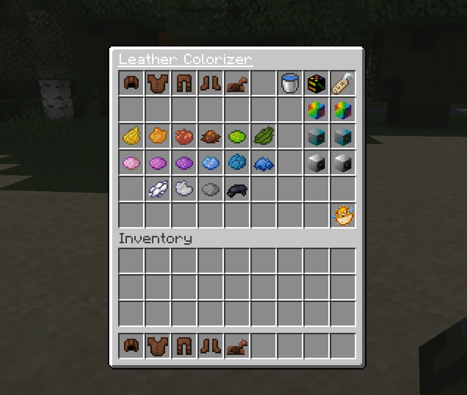

<h1>Leather Colorizer</h1>
<strong>Change Leather Armors colors easily.</strong>
<h3>
    <a href="https://github.com/LordRazen/leather-colorizer/blob/main/README.md">Leather Colorizer</a>
     | 
    <a href="https://github.com/LordRazen/leather-colorizer/blob/main/docs/DOCS.md">Docs</a>
     | 
    <a href="https://github.com/LordRazen/leather-colorizer/blob/main/docs/CONTRIBUTING.md">Contributing</a>
     | 
    <a href="https://github.com/LordRazen/leather-colorizer/blob/main/docs/CHANGELOG.md">Changelog</a>
     | 
    <a href="https://www.spigotmc.org/resources/leather-colorizer.99462/" target="_blank">Project Page</a>
</h3>

This plugin let you change the color of leather armors easily.

### Features

- Colorize Leather Armor Items and the Leather Horse Armor in any color you want easily.
- Select your desired color:
    - Mix the color using Minecraft Color Dyes.
    - Modify the Color with Hue, Saturation and Brightness Controls.
    - Pick the color directly while clicking on colorized leather items.
    - Get the color directly with typing an RGB HEX Color Code.
- Clean colored Armor Items.
- Allow colorization of damaged items correctly.
- Config Updater will update your config if there're new options.
- Version Support: Minecraft 1.18.2+

### Demoserver

- Minecraft Heads Demoserver: `minecraft-heads.mcpro.co`

### Build information
To build this code you need to install the mvn dependency: [plugin-utils](https://github.com/LordRazen/plugin-utils)
Afterwards you can run ``mvn package``

### Project page

www.minecraft-heads.com

